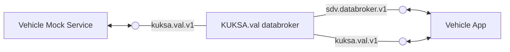

# KUKSA Mock Provider


## About

The KUKSA Mock Provider is a service dummy allowing to control all specified actuator- and sensor-signals via a configuration file. These configuration files are expressed in a Python-based [domain-specific language (DSL)](./doc/pydoc/mocking-dsl.md).

## Why

When developing further vehicle applications, it can be very useful to be able to mock VSS actuators or sensors by specifying configuration files and without developing a new service from scratch. This vehicle mock service provides developers with the ability to do just that. Have a look at the complete concept and design ideas [here](./doc/concept.md)

## Component diagram



## Running Mock Provider

The Kuksa Mock Provider will try to connect to a KUKSA Databroker.
Before starting the Mock Provider you must start a compatible version of the
[KUKSA Databroker](https://github.com/eclipse/kuksa.val/tree/master/kuksa_databroker).
If the Databroker is not reachable on `127.0.0.1:55555` you must specify IP and Port when starting
the Mock provider.
The Mock provider does not have support for TLS and Token authorization,
so you cannot connect to a Databroker requiring TLS or Authorization.

The [default mock](mock/mock.py) contains VSS signals that must exist in the VSS catalog loaded
by the Databroker. As of today VSS 3.0 onwards shall match the default mock in this repository.

Firstly, you will need to install all necessary Python dependencies by issuing the following command in your favorite terminal:

```bash
python3 -m pip install -r ./requirements.txt
```

You can then run the vehicle mock service with

```bash
python3 mockprovider.py
```

### Running with Docker

As an alternative, you can build and execute the container from the [Dockerfile](./Dockerfile).

```console
$ docker build -f Dockerfile -t mock-provider:latest .
$ docker run --net=host mock-provider:latest                                                                                                                                     
INFO:mock_service:Initialization ...                                                                                                                                                                               
INFO:mock_service:Connecting to Data Broker [127.0.0.1:55555]
INFO:kuksa_client.grpc:No Root CA present, it will not be possible to use a secure connection!
...
```

#### Published Container Images

Images are also published to the ghcr registry

```console
docker run --rm --net=host ghcr.io/eclipse-kuksa/kuksa-mock-provider/mock-provider:main
```

If the ghcr registry is not easily accessible to you, e.g. if you are a China mainland user,  we also made the container images available at quay.io:

```console
docker run --rm --net=host quay.io/eclipse-kuksa/mock-provider:main
```

### Running with Devcontainer

A decontainer is provided. To run you must first install dependencies.

```bash
vscode ➜ /workspaces/kuksa-mock-provider  $ python3 -m pip install -r ./requirements.txt
Defaulting to user installation because normal site-packages is not writeable
Processing /workspaces/kuksa-mock-provider
...
vscode ➜ /workspaces/kuksa-mock-provider  $ python3 mockprovider.py
INFO:mock_service:Initialization ...
INFO:mock_service:Connecting to Data Broker [127.0.0.1:55555]
INFO:kuksa_client.grpc:No Root CA present, it will not be possible to use a secure connection!
...
```

## Configuration

### KUKSA Mock Provider Configuration

| parameter      | default value         | Environment variable               | description                     |
|----------------|-----------------------|----------------------------------------------------------------------------------|---------------------------------|
| listen address | `"127.0.0.1:50053"`   | `MOCK_ADDR`                                                                      | Listen for rpc calls            |
| broker address | `"127.0.0.1:55555"`   | `VDB_ADDRESS`| The address of the KUKSA.val databroker to connect to |

Configuration options have the following priority (highest at top):

1. environment variable
2. default value

### Mocking Configuration

By default, the vehicle mock service reads the configuration for the datapoints to mock from the [`mock.py`](mock/mock.py) Python file at runtime. This file is a good starting point edit own mock configurations.

The default configuration contains behavior for:

* `Vehicle.Speed`
* `Vehicle.Cabin.Seat.Row1.Pos1.Position`
* `Vehicle.Body.Windshield.Front.Wiping.System.Mode`
* `Vehicle.Body.Windshield.Front.Wiping.System.TargetPosition`
* `Vehicle.Body.Windshield.Front.Wiping.System.ActualPosition`

This allows the vehicle mock service to be used with the [Velocitas Seat Adjuster](https://eclipse.dev/velocitas/docs/about/use_cases/seat_adjuster/) example, as well as the initial [Vehicle App template](https://github.com/eclipse-velocitas/vehicle-app-python-template). Furthermore, it can be used to develop a wiping application for the front wipers.

### Custom mocking configuration

If the mocked datapoints are not enough, the `mock.py` in this repository can be modified and mounted into the vehicle mock service container - it will then overwrite the default mock configuration with the custom one.

The full Python mocking DSL is available [here](./doc/pydoc/mocking-dsl.md)

## Running showcase GUI

Firstly, you will need to install all necessary Python dependencies by using the following command in your favorite terminal:

```bash
# install requirements of mock service
python3 -m pip install -r ./requirements.txt
```

To run the GUI do the following in your favorite terminal:

```console
python3 showcase_gui/GUI.py
```

If you run it from mock directory the mock datapoints defined by mock.py get used as well:

```console
cd mock
python3 ../showcase_gui/GUI.py
```

Depending on your Python installation, you might need to install Tk on your system (e.g. `brew install tkinter` for MacOs or `sudo apt install python3-tk` for Ubuntu).

## Generating API documentation

The [API documentation](./doc/pydoc/mocking-dsl.md) is generated from Python docs and embedded into markdown files for easy rendering on Github without external hosting. The workflow `ensure-docs-up2date` makes sure that the API docs are up to date before merging a pull request. To update the docs, run

```bash
./update-api-docs.sh
```

## Using mockservice dynamically

To use the mockservice dynamically you need to use the same process. For an example see [threaded_mock.py](examples/threaded_mock.py).

## What's not supported?

Any form of array support e.g no VSS datapoint that has DataType.*ARRAY.
If values in Kuksa Databroker are modified outside of behaviors, the changes won't be picked up by the mock service. Instead try to model another behavior that listens to ACTUATOR_TARGET/VALUE and set it like this.
